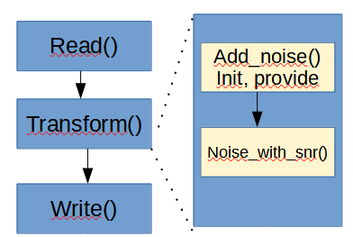

## Аугментация данных

Здесь была реализована задача стриминга в некоторых кругах такой процесс известен как ETL, т.е. извлечение, преобразование и загрузка информации. 

Dataflow  — сервис для преобразования данных (может работать как в realtime так и в batch режиме).

При запуске конвейера потока данных Dataflow создает график выполнения из кода, который создает Pipeline объект, включая все преобразования и связанные с ними функции обработки (например, DoFns). Эта фаза называется временем построения графика и выполняется локально на компьютере, где выполняется конвейер.

Во время построения графа Apache Beam локально выполняет код из основной точки входа кода конвейера, останавливаясь на вызовах к источнику, приемнику или шагу преобразования и превращая эти вызовы в узлы графа. Как последовательность, фрагмент кода в точке входа конвейера (main() метод Java или верхний уровень скрипта Python) локально выполняется на машине , на которой выполняется конвейер, в то время как тот же код, объявленный в методе объекта DoFn, выполняется в рабочих потоках данных <a href = 'https://cloud.google.com/dataflow/docs/guides/deploying-a-pipeline'>[source]</a>.

Это был описан процесс работы pipeline в целом, у нас происходит так: сначала происходит чтение табличного набора данных с описанием чистых файлов, хранимых в формате .csv, затем наложение шума (функция Add_noise()), там же объявляется объект класса Provider, который читает такой табличный файл в формате .csv, выбирает один случайный шум и зашумляет файл, добавляет характеристики зашумленного файла: путь, где он храниться, путь файла с чистой речью, путь файла с шумом, средняя мощность и отношение чистого сигнала к шуму, так как он может быть случайным от -5, 0, 5 (рис. 1). Последним шагом является запись зашумленного файла. Код представлен в файле <a href ='augmentation/beam1_1.ipynb'>beam.ipynb</a>.

Чтобы количество зашумленных файлов по типам было равномерным, был код доработан, чтобы он делил общий набор данных на части по введенному количеству типов шумов на отдельные наборы данных и сохранял их в формате .csv. Далее идет перебор файлов с шумами и процесс аугментации проходит также, только в процессе выбирается определенный файл, а после отработки конвейера сбор всех файлов. 

