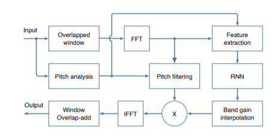
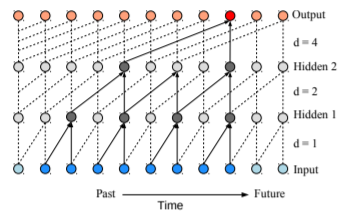
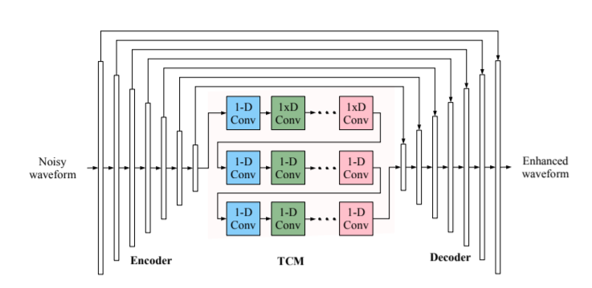
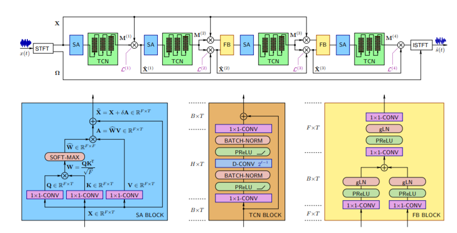

В период пандемии удаленная работа стала «новой нормой». Инструменты для совместной работы на расстоянии стали необходимым средством для организации рабочего процесса. Именно в это время так необходимы аудиозвонки с хорошим и отличным качеством речи. Такие звонки особенно востребованы в совещаниях в крупных корпорациях, в организации занятий во время учебного процесса в школах, университетах, в развлекательных мероприятиях, например, при трансляции выступления симфонического оркестра и т.п.  Однако окружающая среда, в которой может находится аудиоустройство, воспринимающее входящие сигналы, может воспроизводить и воспринимать различные виды фоновых шумов. Сами участники аудиозвонков не могут повлиять на то, чтобы внешние шумы не искажали переданный сигнал. Например, это такие шумы, как лай собаки, плач ребенка, шум кондиционера, движение транспорта,шум столовых приборов на кухне и т.п.

Задача улучшения речи (speech enhancement) состоит в том, чтобы с помощью алгоритмов повысить разборчивость и качество речевого сигнала, загрязненного шумом. 

Самое очевидное применение алгоритмов шумоподавления — в аудиозвонках. Это VoIP, телеконференции в Zoom, Skype и т.п. Также, данные алгоритмы могут использоваться для предварительной обработки аудиосигналов в системах распознавания речи и биометрической идентификации. Для каждой задачи нужный алгоритм шумоподавления выбирается в зависимости от того, насколько “чистым” должен быть аудиосигнал для решения этой конкретной задачи. 

Разработку алгоритмов шумоподавления усложняют такие факторы, как: низкое соотношение сигнала к шуму, быстро меняющиеся распределения вероятностей, нелинейные комбинации различных типов шумов и т. д. В таких неблагоприятных условиях существующие подходы шумоподавления могут улучшить соотношение сигнала к шуму, но, к сожалению, при этом будут генерировать новые искажения: неестественные искажения речи, колеблющиеся остаточные шумы. 

Потому задача разработки алгоритма эффективного подавления шума на аудиосигналах остается актуальной проблемой и темой исследования, которая до сих пор рассматривается во многих статьях.

В 80-х годах данная задача решалась с использованием классических алгоритмов улучшения речи, таких, как: спектральное вычитание, фильтрация Винера, а также алгоритмы, основанные на статистических моделях.

Данные методики основаны на вычислении спектральной оценки и полагаются на спектральную оценку шума, которая, в свою очередь, работает при помощи детектора голосовой активности (VAD). 

Каждые из трёх алгоритмов требуют аккуратной подгонки параметров, а данные параметры трудно настраивать. Нейронные сети, в отличие от вероятностных моделей, поддерживают поток информации только в одном направлении, от входа к выходу. Распознанные последовательности состояний объединяются с зашумленными признаками и используются в качестве входных данных для нейросети, обученной восстанавливать речь.

Данный проект разбит по этапам на разные ветки: 

<ul>
  <li><a href = 'https://github.com/Alena0704/intelligent-noise-reduction/tree/prepare-audio'>Подготовка набора данных</a></li>
  <li><a href='https://github.com/Alena0704/intelligent-noise-reduction/tree/augmentation'>Аугментация данных</a></li>
  <li><a href = 'https://github.com/Alena0704/intelligent-noise-reduction/tree/segan'>Шумоподавление с помощью SEGAN</a></li>
  <li><a href='https://github.com/Alena0704/intelligent-noise-reduction/tree/wavenet>Шумоподавление с помощью WaveNet</a></li>
  <li><a href = 'https://github.com/Alena0704/intelligent-noise-reduction/tree/analize_audio'>Анализ набора данных или аудиосигналов</a></li>
  <li><a href = 'https://github.com/Alena0704/intelligent-noise-reduction/tree/Demoucs_from_Facebook'>Шумоподавление с помощью Demoucs от Facebook</a></li>
    </ul>
   Данная работа носит исследовательский характер в качестве изучения методов шумоподавления, которые были популярны за последние 5 лет.
Ниже представлено описание моделей,которые не отображены в отдельных ветках.
##MMSE-STSA

Данный алгоритм относиться к статистическим алгоритмам и был предложен в 1984 г. Оценка минимальной среднеквадратичной ошибки кратковременной спектральной амплитуды (MMSE-STSA) оптимально оценивает (с помощью алгоритма среднеквадратичной ошибки (MSE)) амплитудный спектр чистой речи. 

В целом, алгоритм MMSE можно представить так: нужно оценить значение переменной Y, у которой заранее известна функция плотности распределения.  Проводится измерение или наблюдение за другой случайной величиной X и ее совместное распределение с переменной Y. Затем, Y оценивается так, чтобы минимизировать среднеквадратичную ошибку между ее фактическим результатом измерения в ходе исследования и полученной оценкой.
 

В нашем случае Y — магнитуда аудиосигнала, X — зашумленный сигнал. Задача состоит в том, чтобы оценить магнитуду аудиосигнала, имея только зашумленный сигнал на входе.

Для применения MMSE к задаче подавления шума на аудиосигнале нужно для начала вычислить SNR сигнала. Для этого по набору данных сначала вычисляют априорную оценку SNR, которую потом корректируют для каждого сэмпла аудио, получая апостериорную оценку SNR. 

Зная SNR и распределение зашумленной речи, с помощью MMSE можно восстановить внутренние компоненты аудиосигнала, из которых после получить оценку чистого аудио без шума

##A Hybrid DSP/Deep Learning Approach to Real-Time Full-Band Speech Enhancement

Данная нейронная сеть имеет рекуррентную архитектуру и состоит из шести слоев.
 

Схема алгоритма показана на рисунке 1. Основная часть подавления шума выполняется на спектральной огибающей низкого разрешения с использованием коэффициентов улучшения. Данные коэффициенты вычисляются с помощью рекуррентной нейронной сети. Коэффициенты улучшения получаются путем вычисления квадратного корня из маски идеального соотношения (ideal ratio mask) (IRM). Более качественное подавление шума между высокими гармониками проводят с помощью comb pitch фильтра.

Другие нейросетевые подходы к данной задаче оценивали магнитуды частотных бинов напрямую. Из-за этого нейронные сети содержали много нейронов и много гипперпараметров. Из-за этого сеть получалась слишком сложной. Потому в данном алгоритме вместо оценки спектральных величин берется оценка идеальных коэффициентов улучшения критической полосы, которая имеет значительное преимущество из-за ограниченного диапазона от 0 до 1. По сравнению с теми алгоритмами, которые оценивали магнитуды частотных бинов напрямую, они содержали много нейронов и много гипперпараметров, что делало эту модель слишком сложной. 

Полосы спектра следуют за Bark шкалой на высоких частотах, но всегда на низких частотах остается не менее 4 бинов. Вместо прямоугольных полос используются треугольные полосы, причем пик отклика приходится на границу между полосами. В результате получается в общей сложности 22 полосы.

Основным недостатком использования полученных значений из Bark полос для вычисления коэффициента шумоподавления является то, что невозможно смоделировать более мелкие детали в спектре. На практике это предотвращает подавление шума между гармониками высоты тона. В качестве альтернативы используется comb фильтр в период высоты тона для подавления межгармонического шума. Поскольку периодичность речевого сигнала сильно зависит от частоты (особенно для частоты дискретизации 48 кГц), то pitch фильтр работает в частотной области на основе коэффициента полосовой фильтрации

##TCNN: Temporal convolutional neural network for real-time speech enhancement in the time domain

TCNN — полностью сверточная нейронная сеть (CNN) для улучшения речи, работающая в реальном времени.Архитектура модели построена на основе энкодера-декодера с дополнительным временным сверточным модулем (TCM). TCM также использует dilated слои с разным шагом в блоке энкодера.

Энкодер принимает последовательность зашумленных фреймов в качестве входных данных, размер которых равен T × 320 × 1, где T - количество окон, 320-размер окна, а 1-количество входных каналов. Первый слой в энкодере увеличивает количество каналов с 1 до 16. Выходной размер после первого слоя равен T×320×16. Следующие семь слоев сжимают размер аудио, используя обычные свертки с размером шага 2. Конечный выход энкодера имеет размерность T× 4 ×64.

Выход энкодера преобразуется в одномерный сигнал размером T × 256. Этот сигнал подается на вход блоку TCM. TCM состоит из трех блоков. Блок в свою очередь состоит из шести dilated сверток (об этом описано ниже). Шесть dilated светок имеют размеры: 1, 2, 4, 8, 16 и 32. Это позволяет алгоритму охватить большую область аудио и извлечь признаки из все более возрастающей рассматриваемой области. Таким образом, он получает глобальную информацию о поступившем аудиосигнале. 

То есть, сначала первая свертка получила локальные признаки аудиосигнала, вторая свертка с шагом два, берет область шире (в два раза больше семплов, чем первая и увеличивает размер шага в два раза больше первой, т.е. рассматривает соседние семплы, по сравнению с предыдущим слоем), соответственно, получает информацию больше первой. Таким образом в самом последнем слое, в конце блока, будет собрана самая общая информация об аудиосигнале (см. рис. 3).

Архитектура декодера симметрична архитектуре энкодера и имеет skip-соединения со слоями энкодера.

##Speech Enhancement Using Multi-Stage. Self-Attentive Temporal Convolutional Networks

Данная нейронная сеть состоит из четырех блоков слоев, которые авторы назвали TCN. Архитектура блока следующая: слой самовнимания (Self-Attention, SA), за которым следуют три сверточных слоя с нормализацией и функциями активации ReLU между ними. Также в каждом блоке есть skip-connection между первым и последним слоем блока. Каждый блок, по сути, уже выдает  предсказание, которое уточняется в каждом последующем блоке. Механизм самовнимания агрегирует контекстную информацию по каналам, что помогает в процессе работы сети создавать динамичное представление аудио. 

Два последних TCN блока содержат блок слияния (FB). Этот блок выполняет функцию skip-connection: он принимает на вход исходную речевую информацию, чтобы восполнить возможную потерю речевой информации, которая произошла на ранних стадиях обработки аудиосигнала.

Подробная архитектура сети, как и архитектуры отдельных блоков SA, TCN и FB, представлены на рисунке ниже. 

В отличие от предыдущих, модель не обрабатывает исходный аудиосигнал. Она обрабатывает его частотно-временное представление, которое получается с помощью алгоритма быстрого преобразования Фурье (STFT). После обработки, получившиеся частотно-временное представление аудиосигнала подвергается обратному преобразованию Фурье.

