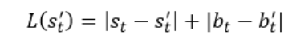
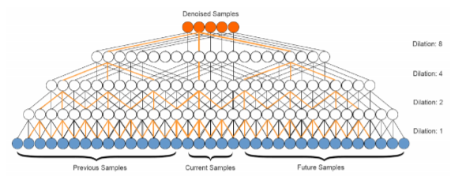

## A Wavenet for Speech Denoising

WaveNet —  идея архитектуры сети  для применении в нескольких задачах: генерации аудио и шумоподавления сигнала.
Данная нейросеть отличается от предыдущих тем, что не использует частотно-временные представления или амплитудные спектрограммы в качестве входных данных для уменьшения большой размерности необработанных сигналов. Тем самым она не сталкивается с недостатками, связанными с отбрасыванием потенциально ценной информации (по фазе) и недостатками при использовании универсальных методов для извлечения признаков (например, анализ амплитудных спектрограмм). Модель конкретно изучает признаки у поданного ей сигнала.
Архитектура модели также основана на свертках. Это делает ее гибкой во временнОм измерении.Примечательно, что модель использует контекстную информацию для обработки аудио. Для того, чтобы обработать один фрагмент аудиосигнала, модель смотрит также на части аудиозаписи до и после этого фрагмента. Это позволяет собрать полезную информацию для дальнейшей обработки текущих рассматриваемых фрагментов. Сама архитектура модели изображена на рисунке 4, где выходной слой равен размеру рассматриваемых семплов.
Функция потерь, которая используется для обучения:

s – аудиосигнал без шума, b – аудиосигнал с шумом.

Авторы статьи пробовали два подхода к функции потерь: кросс-энтропию и softmax, на которой в итоге остановились. Выбор обусловлен тем, что при использовании кросс-энтропии и функции активации softmax изначально определены бины, и нейросеть по ним предсказывает классы. Если переводить в задачу аудиоанализа, то тут предсказание идет в частоты, то есть в какой бин частоты попадают исследуемые семплы. При этом softmax всегда должен выдавать дискретные значения, то есть нейросеть попадает либо в первый, либо во второй бин и т.д. Качественные результаты авторы так и не получили, и поэтому в модели используется softmax.
Модель также испытывала трудности с фрагментами аудиосигнала, где нет речи. Чтобы справиться с этим, авторы использовали аугментацию данных. Она заключается в том, что к семплам без речи добавляется случайный шум, и они подаются на вход нейросети в процессе обучения. Таким образом сеть лучше учится убирать шум из фрагментов с тишиной (без голоса). Однако у модели все еще есть свои ограничения, а именно: ее неспособность справляться с внезапными помехами, такими как гудки в городском движении.

Источник: <a href='https://arxiv.org/pdf/1706.07162.pdf'>Здесьвы можете посмотреть на оригинал статьи</a>
