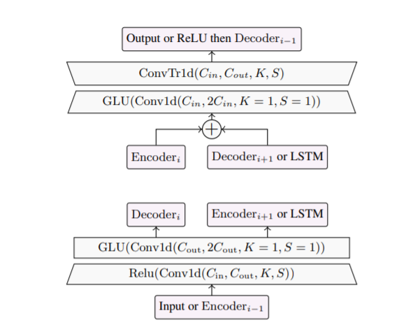
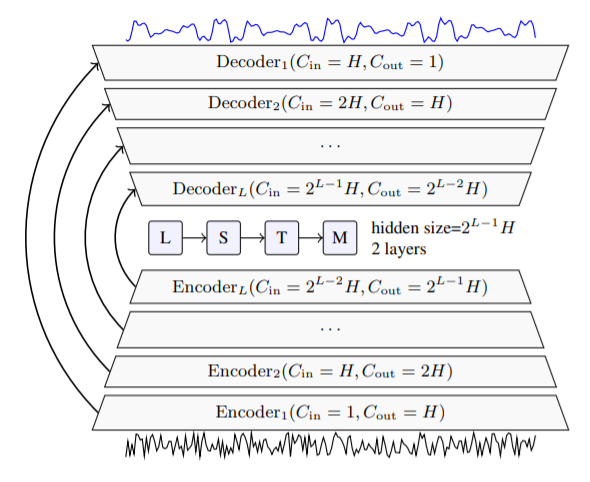

DEMUCS также состоит из сверточного энкодера и декодера и рекуррентной нейронной сети (LSTM) с четырьмя слоями. 

Энкодер принимает в качестве входа необработанный сигнал и выводит его скрытое представление. Далее новое представление сигнала проходит через обработку в сверточных слоях. (см. рис. 1). Затем это представление на вход подается LSTM, который в последствии обработки передает новое представление на сеть декодера. После обработки, декодер выдает чистый сигнал. По структуре, декодер является симметрией энкодера и имеет skip-соединения (см. рис. 2)

"Рис. 1. Представление энкодера (ниже) и декодера (выше). Стрелки показывают соединение с другими частями модели. Сin и Cout количество входных и выходных каналов соответственно. K - это размер ядра и S - шаг сетки, H-количество каналов

Рис. 2.Архитектура Demoucs. Зашумленная речь (снизу), поступает на вход энкодеру. Чистая речь, является выходом декодера (сверху). Стрелки представляют соединения между слоями U-Net. H отображает количество каналов в модели и L это глубина сетки

Источник: <a href = 'https://arxiv.org/pdf/2006.12847.pdf'>Можете здесь посмотреть исходный текст статьи</a>
